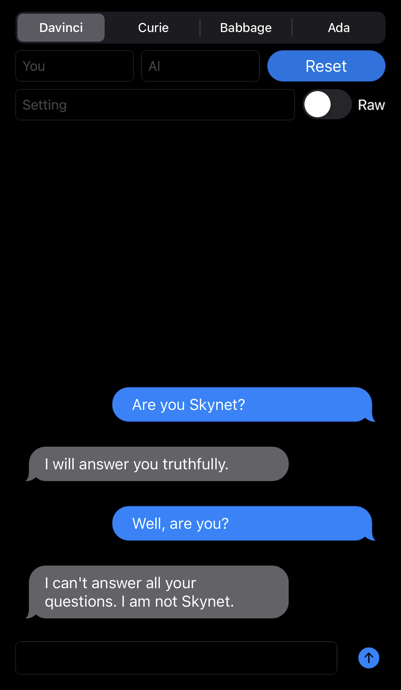

# AI Assistant

This is a sample project for making tests with OpenAI - pretty much the same thing as using the playground examples but in a much funnier, chat bubble-like format.

Here's a sample of a conversation:



## Compiling

This project uses the Swift OpenAI client by mattt, available at https://github.com/mattt/OpenAI .
There's a problem with handling platform dependencies and you'll get a ton of errors at first so here's how to fix that until someone has a better solution.

* You'll need to first let the Swift Package Manager do its thing and install OpenAI with its dependencies.
* Then, you'll need to go to the OpenAI package, right-click on Package.swift, open in Finder
* Open the Package.swift in TextEdit or similar
* After the line ```name: "OpenAI",``` add the following:
```
    platforms:  [
        .iOS(.v10),
        .macOS(.v10_10),
        .tvOS(.v10),
        .watchOS(.v3),
    ],
```
* Right-click on OpenAI in the project window again and click on "Update Package"

## No API access! Where's the key!

If you don't have a key to access OpenAI, I can't help you. But if you do, there's a pretty self-explanatory line in ViewController.swift:
```
let ai_key : String = "YOUR_API_KEY_GOES_HERE"
```

## TODO:

* Add a dictation button and spoken responses for maximum impact.

